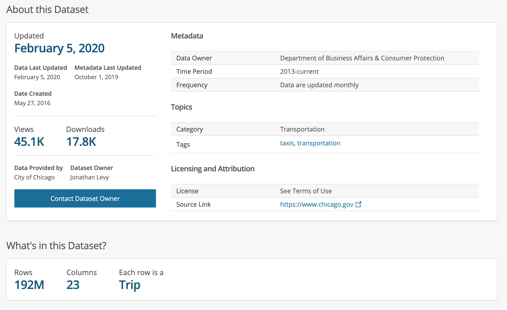
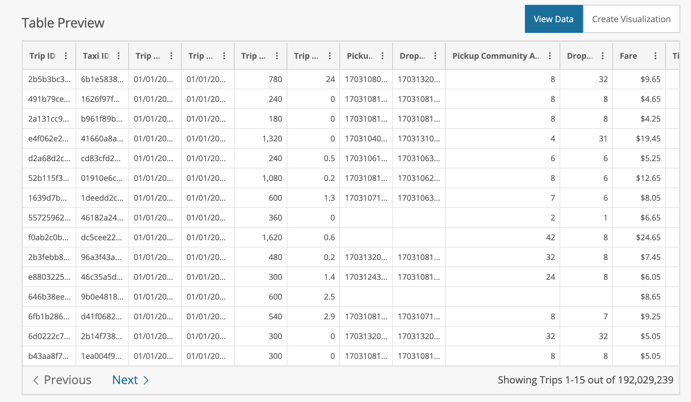
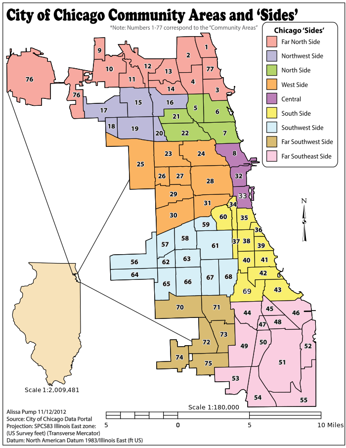
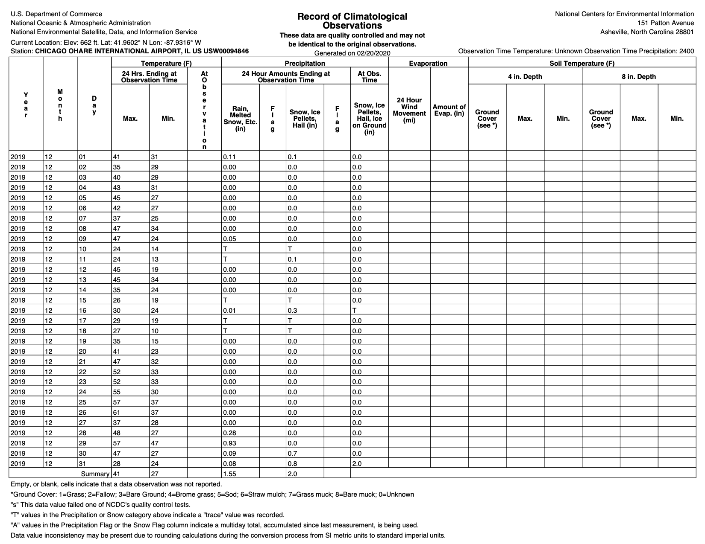

# Data Engineering Capstone Project

## Scope of the project and datasets

In the current project, a public Chicago Taxi Trips dataset will be used.
We will take information for last several months and combine it with weather data, and weather conditions during each day, recorded in Chicago OHARE INTERNATIONAL AIRPORT.
Data will be processed and ready to be loaded for further analysis.

Chicago taxi dataset is a public dataset that can be found at: https://data.cityofchicago.org/Transportation/Taxi-Trips/wrvz-psew

The weather dataset can be found here: https://www.ncdc.noaa.gov/cdo-web/datasets

ETL process will be performed on the AWS EMR Spark cluster, and data will be loaded to Data Lake only during last step. All processing steps will happen in memory.

Data will then be saved in S3 Data Lake in Parquet format, that would allow it to be easily queryable with tools like Presto, AWS Athena or AWS Glue.

Last step can be changed if needed, for example for data to be written directly to Redshift cluster.
 However, all the tables should be created beforehand performing such option.

The final tables will have a format that can support running predefined queries.
 This means, it could be beneficial to load the data into NoSQL database, such as Cassandra, that allows exactly that kind of queries.

## Technologies
* Python: Best choice for exploratory data analysis and integration between various services and technologies.
* Spark (EMR cluster): for running ETL Pipelines on large datasets (20 Gb).
* S3: fast and highly available storage solution. Can be easily integrated with Redshift or NoSQL database, such as Cassanda.

_____
## Update Cycles

**Taxi Trips**: An official dataset is updated monthly, so it would make sense to update data on a monthly basis and append to existing tables.

However if similar dataset is available 24/7, it would make sense to update it at least daily (or weekly), to provide as much useful insights for passengers, cab drivers, taxi companies as well as for Chicago Transport official institutions.

**Weather**: Can be updated daily, however monthly updates is enough (as this will match updates to the main Taxi Trips dataset).

_____

# Dataset Description

## Chicago Taxi Trips Dataset

Dataset is described in details on the official website, however we provide general outline of the whole dataset below.

## Chicago Community Areas

Chicago is officially divided into 77 community areas (zones). More can be learned via this link: https://en.wikipedia.org/wiki/Community_areas_in_Chicago

Data can be populated with real area names, however for many purposes, keeping number mapping makes more sense.

## Chicago Weather data

Temperature data in Chicago is a dataset of temperatures recoded for each day at  **CHICAGO OHARE INTERNATIONAL AIRPORT, IL US** station since 1954.

The weather dataset can be found here: https://www.ncdc.noaa.gov/cdo-web/datasets

A subset of this dataset for the period from January 2018 until today, as we interested about most recent events.

Weather data for one day looks like the following:

# Supported Scenarios and Future Work

## Conceptual Data Model

The conceptual data model is going to extend existing Taxi Trips Dataset with Weather temperature collected for each given day in Chicago Ohara Airport. The weather data additionally contains weather conditions, that may be useful for prediction of various traveling patterns in Chicago city.

Initial Taxi Trips dataset contains **23** columns and weather dataset - **40** columns.

Given the combined data, we would be able to provide enough data that can be used for many use cases.

The following use-cases using created data models can be targeted:

* as a Taxi Driver, I would be able to choose better location for passenger pickups, during exact hour of the day, season, and weather conditions at the given moment.

* as a Data Analyst, I would be able to analyze data for each Trip, for each driver. I would be able to collect driver ratings based on number of trips per week/month and amount of tips collected.

* as a Machine Learning engineer, I would be able to use data to predict best places for passenger pickups, if tips will be given, if the passenger flow will increase at any given day, etc.

* Additionally, information that is collected for each Taxi Cab can help companies to decide if any repair works should be performed

* Payment patterns can be defined, e.g for any short/long trips

* Can ride-sharing opportunity be explored and in which area with with higher probability

And many other use cases can be supported.

# Data Model

### Main Fact Table
Cleaned Taxi Trip data joined with Weather Data (temperature and amount of Precipitation, Snow, etc.)

Colums of **extended_chicago_taxi_rides** table:

 |column| type| description
 |:-----|:----|:-----------
 |trip_id| string|  A unique identifier for the trip.
 |taxi_id| string| A unique identifier for the taxi.
 |trip_start_timestamp| timestamp| When the trip started, rounded to the nearest 15 minutes.
 |trip_end_timestamp| timestamp| When the trip ended, rounded to the nearest 15 minutes.
 |day_of_week| integer| Day of week when trip started
 |month|int| Month when trip started
 |hour|int| Hour when trip started. As data rounded to 15 minutes, we don't need more precision
 |trip_seconds| integer| Time of the trip in seconds.
 |trip_miles| double|  Distance of the trip in miles.
 |pickup_census_tract| long| The Census Tract where the trip began.
 |dropoff_census_tract| long | The Census Tract where the trip ended.
 |pickup_community_area| integer | The Community Area where the trip began
 |dropoff_community_area| integer | The Community Area where the trip ended.
 |fare| double | The fare for the trip.
 |tip| integer | The tip for the trip. Cash tips generally will not be recorded.
 |additional_charges| double | The tolls for the trip.
 |extra| double |Extra charges for the trip.
 |trip_total| double | Total cost of the trip, the total of the previous columns.
 |payment_type| string| Type of payment for the trip.
 |taxi_company| string | The taxi company.
 |pickup_centroid_latitude| double | The latitude of the center of the pickup census tract.
 |pickup_centroid_longitude| double | The longitude of the center of the pickup census tract.
 |dropoff_centroid_latitude| double | The latitude of the center of the dropoff census tract.
 |dropoff_centroid_longitude| double | The longitude of the center of the dropoff census tract.
 |AWND | double    | Average wind speed
 |PRCP | double    | Precipitation
 |SNOW | double    | Snowfall
 |SNWD | double    | Snow depth
 |TMAX | double    | Maximum temperature
 |TMIN | double    | Minimum temperature
 |TAVG | double    | Average temperature

### 1st Dimension Table
Table will contain information about Taxi Cabs, trips they performed and general infofrmation about each trip.

Colums of **cabs** table:

 |column| type| description
 |:-----|:----|:-----------
 |taxi_id| string| A unique identifier for the taxi.
 |trip_id| string|  A unique identifier for the trip.
 |trip_start_timestamp| timestamp| When the trip started, rounded to the nearest 15 minutes.
 |trip_end_timestamp| timestamp| When the trip ended, rounded to the nearest 15 minutes.
 |trip_seconds| integer| Time of the trip in seconds.
 |trip_miles| double|  Distance of the trip in miles.
 |pickup_community_area| integer | The Community Area where the trip began
 |dropoff_community_area| integer | The Community Area where the trip ended.
 |fare| double | The fare for the trip.
 |tip| integer | The tip for the trip. Cash tips generally will not be recorded.
 |additional_charges| double | The tolls for the trip.
 |extra| double |Extra charges for the trip.
 |trip_total| double | Total cost of the trip, the total of the previous columns.
 |payment_type| string| Type of payment for the trip.
 |taxi_company| string | The taxi company.

### 2nd Dimension Table
Table that collects popular locations in each community area in Chicago city.

May be used by Taxi Drivers to choose better location for pickups during time of the day and weather conditions at the given moment.

Colums of **community_areas** table:

 |column| type| description
 |:-----|:----|:-----------
 | community_area| integer | The Community Area id
 | centroid_latitute | double | Latitude of the location inside the Community Area (rounded to 20 meters)
 | centroid_longitude | double | Longitude of the location inside the Community Area (rounded to 20 meters)

### 3d Dimension Table for Machine Learning Team
Table with taxi data with missing values for `Census Tract` and `Location`

Colums of **taxi_data** table:

 |column| type| description
 |:-----|:----|:-----------
 |trip_id| string|  A unique identifier for the trip.
 |taxi_id| string| A unique identifier for the taxi.
 |trip_start_timestamp| timestamp| When the trip started, rounded to the nearest 15 minutes.
 |trip_end_timestamp| timestamp| When the trip ended, rounded to the nearest 15 minutes.
 |trip_seconds| integer| Time of the trip in seconds.
 |trip_miles| double|  Distance of the trip in miles.
 |pickup_census_tract| long| The Census Tract where the trip began.
 |dropoff_census_tract| long | The Census Tract where the trip ended.
 |pickup_community_area| integer | The Community Area where the trip began
 |dropoff_community_area| integer | The Community Area where the trip ended.
 |fare| double | The fare for the trip.
 |tip| integer | The tip for the trip. Cash tips generally will not be recorded.
 |additional_charges| double | The tolls for the trip.
 |extra| double |Extra charges for the trip.
 |trip_total| double | Total cost of the trip, the total of the previous columns.
 |payment_type| string| Type of payment for the trip.
 |taxi_company| string | The taxi company.
 |pickup_centroid_latitude| double | The latitude of the center of the pickup census tract or the community area if the census tract has been hidden for privacy. This column often will be blank for locations outside Chicago.
 |pickup_centroid_longitude| double | The longitude of the center of the pickup census tract or the community area if the census tract has been hidden for privacy. This column often will be blank for locations outside Chicago.
 |pickup_centroid_location| string | The location of the center of the pickup census tract or the community area if the census tract has been hidden for privacy. This column often will be blank for locations outside Chicago.
 |dropoff_centroid_latitude| double | The latitude of the center of the dropoff census tract or the community area if the census tract has been hidden for privacy. This column often will be blank for locations outside Chicago.
 |dropoff_centroid_longitude| double | The longitude of the center of the dropoff census tract or the community area if the census tract has been hidden for privacy. This column often will be blank for locations outside Chicago.
 |dropoff_centroid_location| string | The location of the center of the dropoff census tract or the community area if the census tract has been hidden for privacy. This column often will be blank for locations outside Chicago.

### Secondary Weather Fact Table
Table about weather data and data conditions.

Joined table of **1st Weather Dimension Table** and **2nd Weather Dimension Table**, both described below.

Table schema left out for readability and to avoid duplication.

Colums of **weather** table - joined columns of **temperature** and **conditions** tables by DATE coulmn.

This table is not of particular interest for our needs, as mostly we are going to work with tables defined below

### 1st Weather Dimension Table
Table that contains temperature and precipitation data

Colums of **temperatures** table:

|column | type  | description |
|:-------|:-------|:-|
|DATE | timestamp | Date of measurements
|AWND | double    | Average wind speed
|PRCP | double    | Precipitation
|SNOW | double    | Snowfall
|SNWD | double    | Snow depth
|TMAX | double    | Maximum temperature
|TMIN | double    | Minimum temperature
|TAVG | double    | Average temperature

### 2nd Weather Dimension Table
Table with weather conditions data for each day

Colums of **conditions** table:

column | type  | description |
:------|:-------|:-|
DATE| timestamp| Date of measurements
FOG| int | Fog during the  day
HEAVY_FOG| int | Heavy or freezing fog during the day
THNDR| int | Thunder during the day
ICE| int | Ice pellets, sleet, snow pellets, or small hail
HAIL| int| Hail during the day
HVSNOW|int | Blowing or drifting snow
